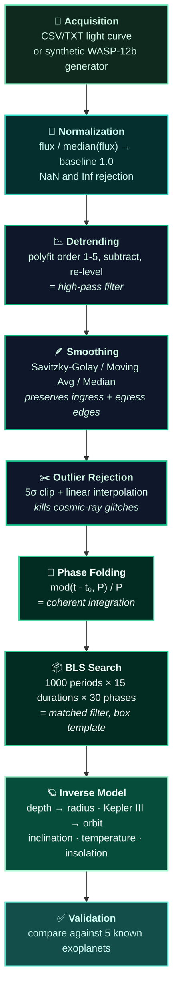

<!-- ============================ ANIMATED HEADER ============================ -->
<p align="center">
  
</p>

<p align="center">
  <a href="#-quick-start">
    
  </a>
</p>

<p align="center">
  
  
  
  
</p>

<p align="center">
  <a href="docs/Exoplanet%20Detection%20System%20Report.pdf"></a>
  <a href="#-screenshot-gallery"></a>
  <a href="#-transit-animation"></a>
  <a href="ExoplanetDetectionSystem.m"></a>
  <a href="#-the-team"></a>
</p>


## 🌌 What This Is

When a planet crosses in front of its star, the star gets *very slightly* dimmer. A Jupiter-sized
planet blocks about **1%** of the light. An Earth-sized planet blocks **0.01%**. That dip is buried
under starspot pulsations, telescope sensor drift, and photon noise — and it is the only evidence
that the planet exists at all.

This is a **MATLAB GUI application** that digs the signal back out. Load a light curve, condition it,
run a Box Least Squares period search, and the system hands back the planet's **radius, orbital
distance, velocity, inclination, and equilibrium temperature** — then validates the answer against
a database of known exoplanets.

It is, underneath the astronomy, a **pure Signals and Systems problem**: detrending is a high-pass
filter, phase folding is coherent integration, and BLS is a matched filter looking for a periodic
square wave.

> **Course:** Signals and Systems — Term Project, 5th Semester
> **Institution:** FCSE
> **Submitted to:** Sir Zaheer · **Course Instructor:** Dr. Hanif


## 👥 The Team

<table>
<tr>
<td align="center" width="33%">
  
  <br/><br/><b>Hassan Khalid</b>
  <br/><sub>FCSE · 2023435</sub>
  <br/><br/><a href="https://github.com/HassanKhalid8"></a>
</td>
<td align="center" width="33%">
  
  <br/><br/><b>Saad Mirza</b>
  <br/><sub>FCSE · 2023498</sub>
</td>
<td align="center" width="33%">
  
  <br/><br/><b>Moiz Kakakhel</b>
  <br/><sub>FCSE · 2023315</sub>
</td>
</tr>
</table>


## 🔭 Signal Processing Pipeline




## 🎬 Transit Animation

The app renders a live orbital animation — 150 frames, with the planet turning **red** the moment it
crosses in front of the stellar disk (`pos_z < 0` **and** projected distance < stellar radius), while
a running readout tracks elapsed time and orbital phase.

https://github.com/HassanKhalid8/Exoplanet-Transit-Detection-System/raw/main/images/Transit%20Animation.mp4

<p align="center">
  <a href="images/Transit%20Animation.mp4"></a>
</p>


## 🧠 Signals and Systems Concepts

<details open>
<summary><b>1️⃣ &nbsp; Detrending as a High-Pass Filter</b></summary>

<br/>

Stars are not stable light sources. Starspots rotate in and out of view, the star pulsates, and the
telescope's sensor drifts thermally. All of this is **low-frequency** — far slower than a transit.

The system fits a polynomial (order 1–5, default 2) across the whole time series and subtracts it:

```matlab
coefficients   = polyfit(time_vals, flux_vals, poly_degree);
trend_line     = polyval(coefficients, time_vals);
detrended_flux = flux_vals - trend_line + 1.0;
```

Subtracting a smooth low-order model and adding the baseline back is exactly a **high-pass filter** —
it flattens the tilt while leaving the sharp, fast transit dip untouched.

</details>

<details>
<summary><b>2️⃣ &nbsp; Why Savitzky-Golay and Not a Moving Average</b></summary>

<br/>

This is the most important filtering decision in the project.

A **moving average** is a boxcar convolution — it is a low-pass filter with a `sinc` frequency
response, and it *rounds off sharp transitions*. In a transit, the sharp transitions are the
**ingress** (planet starts crossing) and **egress** (planet finishes crossing). Those edges encode
the planet's velocity and the orbital geometry. Blurring them destroys real physical information.

**Savitzky-Golay** fits a local polynomial (order 3 here) by least squares inside a sliding window
and evaluates it at the centre. Because it preserves higher-order moments of the signal, it
suppresses white noise **without flattening the edges**.

| Filter | Window | Behaviour |
| :-- | :-- | :-- |
| **Savitzky-Golay** *(default)* | `min(51, N/10)`, forced odd | Order-3 local least squares — preserves ingress/egress |
| Moving Average | `min(25, N/20)` | Fast, but blurs the transit edges |
| Median Filter | `min(25, N/20)` | Robust to impulsive outliers, non-linear |

After smoothing, a **5σ outlier clip** removes cosmic-ray hits and sensor glitches, replacing them by
linear interpolation rather than deleting samples — which keeps the time base intact for phase folding.

</details>

<details>
<summary><b>3️⃣ &nbsp; Phase Folding = Coherent Integration</b></summary>

<br/>

A single transit is far too shallow to trust. But the planet transits *every orbit* — so if you know
the period, you can stack every transit on top of the others.

```matlab
phases = mod(time_vals - min(time_vals), current_period) / current_period;
```

That modulo operation wraps the entire time series onto a single orbital cycle. When the trial period
is **correct**, every transit lands at the same phase and the dips **add constructively**, while the
noise — being uncorrelated — **adds destructively**. Signal grows as $N$, noise grows as $\sqrt{N}$,
so SNR improves as $\sqrt{N}$. That is coherent integration, and it is why the test data spans
**25 orbits** rather than one.

</details>

<details>
<summary><b>4️⃣ &nbsp; Box Least Squares as a Matched Filter</b></summary>

<br/>

Matched filtering says: to detect a known signal shape in noise, correlate against a template of that
shape. A transit is, to first order, a **rectangular dip** — so the template is a box.

The BLS engine performs an exhaustive 3-D search:

$$\text{1000 trial periods} \times \text{15 trial durations} \times \text{30 trial phases} = \textbf{450,000 box fits}$$

Trial durations span 2%–15% of the period; trial phase centres sweep the full cycle. For each
candidate box, the detection score is:

```matlab
score = (transit_depth / flux_std) * sqrt(sum(in_transit_mask));
```

which is exactly the matched-filter SNR form $\mathrm{SNR} = \frac{\delta}{\sigma}\sqrt{N}$ —
depth over noise, scaled by the square root of the number of in-transit samples. Guard conditions
require at least **3 in-transit** and **10 out-of-transit** points, and reject any candidate where
the "dip" is actually a bump.

</details>

<details>
<summary><b>5️⃣ &nbsp; The Inverse Model — Signal Back to Physics</b></summary>

<br/>

Detection gives you *signal* properties (depth, period, duration). The characterization module maps
those back to *system* properties — the actual planet.

**Planet radius** — the star is a disk, so a transit blocks an area ratio:

$$\delta = \frac{\Delta F}{F} = \left(\frac{R_p}{R_\star}\right)^{2} \quad \Longrightarrow \quad R_p = R_\star\sqrt{\delta}$$

**Orbital distance** — Kepler's Third Law, solved for the semi-major axis:

$$a = \sqrt[3]{\frac{G M_\star P^{2}}{4\pi^{2}}}$$

**Detection significance:**

$$\mathrm{SNR} = \frac{\delta}{\sigma}\sqrt{N_{\text{transits}}}$$

Also derived: orbital velocity $v = 2\pi a / P$, impact parameter, inclination
$\cos i = b R_\star / a$, equilibrium temperature $T_{eq} = T_\star\sqrt{R_\star / 2a}$, and
insolation relative to Earth $S = a^{-2}$.

**Constants used:** $G = 6.6743\times10^{-11}$, $M_\odot = 1.989\times10^{30}$ kg,
$R_\odot = 6.96\times10^{8}$ m, $R_\oplus = 6.371\times10^{6}$ m, $R_{jup} = 6.9911\times10^{7}$ m,
$1\ \mathrm{AU} = 1.496\times10^{11}$ m, $T_\star = 5778$ K.

</details>


## 🖥️ The Application

A six-step control panel on the left, five visualization tabs on the right.

| Step | Control | What Happens |
| :-: | :-- | :-- |
| **1** | `Load CSV/TXT File` · `Generate Test Data` | Reads `[time, flux]` (optional 3rd error column), or synthesizes a WASP-12b-like curve |
| **2** | Smoothing filter + polynomial order → `Apply Filters` | Detrend, smooth, 5σ outlier clip |
| **3** | Min/Max period → `Search for Transits` | BLS sweep with a cancellable progress dialog |
| **4** | Star radius (solar radii) → `Calculate Planet Parameters` | Full inverse model |
| **5** | `Start Transit Animation` · `Show 3D Orbit` | 150-frame animation · interactive rotatable 3D orbit |
| **6** | `Compare with Known Planets` | Scores the detection against 5 catalogued exoplanets |

**Tabs:** Light Curve Data · Period Analysis · 3D Orbital View · Transit Animation · Results Validation

### 🧪 The Synthetic Test Signal

`Generate Test Data` builds a ground-truth light curve so the pipeline can be validated end to end:

| Property | Value |
| :-- | --: |
| Data points | 15,000 |
| Observation span | 25 orbital periods |
| True period | 1.0914 days |
| True depth | 0.0143 (1.43%) |
| True duration | 0.1145 days (~2.75 h) |
| Photon noise | σ = 0.0008 |
| Stellar variation | 0.0015 · sin(2πt / 8.5) |

That stellar variation term is deliberately given an **8.5-day** period — far slower than the
1.09-day transit — so the detrending stage has something realistic to remove.


## 📊 Measured Results

Running the full pipeline on the synthetic WASP-12b signal:

<table>
<tr><td valign="top" width="50%">

**Recovered Transit**

| Quantity | Detected | True |
| :-- | --: | --: |
| Orbital period | **1.08559 d** | 1.0914 d |
| Transit depth | 0.8384% | 1.43% |
| Transit duration | 3.908 h | 2.75 h |

</td><td valign="top" width="50%">

**Derived Planet**

| Quantity | Value |
| :-- | --: |
| Planet radius | 10.003 $R_\oplus$ (0.912 $R_{jup}$) |
| Semi-major axis | 0.0207 AU |
| Orbital velocity | 207.18 km/s |
| Inclination | 78.55° |
| Impact parameter | 0.882 |
| Equilibrium temp. | 1938 K |
| Insolation | 2339.77 × Earth |

</td></tr>
</table>

**Validation against the catalogue** — best match **WASP-12b**, which is the correct answer:

| Parameter | Error |
| :-- | --: |
| **Period** | **0.53%** ✅ |
| Depth | 41.37% |
| Radius | 30.05% |
| *Total* | *71.95%* |

### 🔍 Honest Reading of These Numbers

**The period search is the real success.** The BLS engine recovered 1.08559 days against a true
1.0914 days — **0.53% error**, and the periodogram spike reaches a power of ~92 against a 3σ
detection floor. The system correctly identified WASP-12b as the closest catalogue match out of five
candidates. That is the part of the pipeline the project set out to build, and it works.

**The depth is systematically under-estimated, and that is explainable.** At 15,000 points across
25 periods, the sampling cadence is ~0.0018 days, so the 0.1145-day transit spans only about
**63 samples** — while the Savitzky-Golay window is **51 samples**. The smoothing window is
comparable in width to the feature being measured, so it partially averages the dip away. The
recovered duration being *too long* (3.9 h vs 2.75 h) is the same effect seen from the other side:
the box got smeared wider and shallower.

Since $R_p \propto \sqrt{\delta}$, a 41% depth error propagates to a ~30% radius error — which is
exactly the gap observed. **Fix:** shrink the smoothing window (or raise the sampling density) so the
window is a small fraction of the transit duration rather than most of it.


## 🖼️ Screenshot Gallery

> *Click any thumbnail for full resolution.*

<table>
<tr>
<td width="50%" align="center">
  <a href="images/Generating%20Text%20Data.png"></a>
  <br/><b>🌠 Synthetic Data Generation</b>
  <br/><sub>15,000-point WASP-12b light curve with photon noise and stellar variation</sub>
</td>
<td width="50%" align="center">
  <a href="images/Applying%20Filter.png"></a>
  <br/><b>🪶 Detrending + Smoothing</b>
  <br/><sub>Raw curve in grey against the Savitzky-Golay result in blue — the tilt is gone</sub>
</td>
</tr>
<tr>
<td width="50%" align="center">
  <a href="images/Searching%20for%20Transit.png"></a>
  <br/><b>🔁 Phase-Folded Light Curve</b>
  <br/><sub>Every orbit stacked into one cycle — the U-shaped dip emerges from the noise</sub>
</td>
<td width="50%" align="center">
  <a href="images/Period%20Analysis.png"></a>
  <br/><b>📈 BLS Periodogram</b>
  <br/><sub>Power spike at 1.0856 d against the 3σ floor — smaller peaks are its harmonics</sub>
</td>
</tr>
<tr>
<td width="50%" align="center">
  <a href="images/Planet%20Parameters.png"></a>
  <br/><b>🪐 Derived Planet Properties</b>
  <br/><sub>Radius, orbit, velocity, inclination, temperature and insolation from the inverse model</sub>
</td>
<td width="50%" align="center">
  <a href="images/3D%20Orbit.png"></a>
  <br/><b>🛰️ 3D Orbital View</b>
  <br/><sub>Star, planet and orbital plane rendered at the measured 78.6° inclination — drag to rotate</sub>
</td>
</tr>
<tr>
<td width="50%" align="center">
  <a href="images/Result%20Validation.png"></a>
  <br/><b>✅ Catalogue Validation</b>
  <br/><sub>Detection vs WASP-12b across period, depth and radius</sub>
</td>
<td width="50%" align="center">
  <a href="images/Transit%20Animation.mp4"></a>
  <br/><br/><b>🎬 Transit Animation</b>
  <br/><sub>150-frame orbital animation — the planet turns red mid-transit. <a href="#-transit-animation">Play above ↑</a></sub>
</td>
</tr>
</table>


## 🗃️ Validation Catalogue

The system scores its detection against five real exoplanets from the NASA Exoplanet Archive:

| Planet | Period (days) | Depth | Radius ($R_\oplus$) | Type |
| :-- | --: | --: | --: | :-- |
| **WASP-12b** | 1.0914 | 0.0143 | 14.3 | Ultra-hot Jupiter |
| **HD 209458b** | 3.5247 | 0.0157 | 13.9 | Hot Jupiter |
| **Kepler-10b** | 0.8375 | 0.000152 | 1.47 | Lava super-Earth |
| **TRAPPIST-1e** | 6.099 | 0.00055 | 0.92 | Habitable-zone rocky |
| **55 Cancri e** | 0.7365 | 0.00013 | 1.99 | Super-Earth |

The spread here is deliberate — depths range over **two orders of magnitude**, from a 1.4% hot-Jupiter
eclipse down to a 0.013% super-Earth whisper.


## 🚀 Quick Start

**Prerequisites** — MATLAB with the Signal Processing Toolbox (needs `sgolayfilt`, `medfilt1`,
`readmatrix`; App Designer UI components require R2019a or newer).

```bash
git clone https://github.com/HassanKhalid8/Exoplanet-Transit-Detection-System.git
```

```matlab
cd Exoplanet-Transit-Detection-System
ExoplanetDetectionSystem
```

Then, to reproduce the results above:

1. **`Generate Test Data`** — builds the synthetic WASP-12b curve
2. **`Apply Filters`** — Savitzky-Golay, polynomial order 2
3. **`Search for Transits`** — leave the range at 0.5 → 20 days *(takes a minute; 450,000 box fits)*
4. **`Calculate Planet Parameters`** — star radius 1.0 solar radii
5. **`Show 3D Orbit`** and **`Start Transit Animation`**
6. **`Compare with Known Planets`** — should land on WASP-12b

**Using your own data:** a CSV or TXT file with columns `time, flux` and an optional third
`flux_error` column. Flux is auto-normalized to a median of 1.0, and non-finite samples are dropped.


## 📁 Repository Layout

```text
Exoplanet-Transit-Detection-System/
│
├── 🔭 ExoplanetDetectionSystem.m     # Entire application — GUI + pipeline
│   ├── setupGUI                      # 6-section control panel, 5 visualization tabs
│   ├── loadDataFromFile / readDataFile
│   ├── generateTestData              # Synthetic WASP-12b light curve
│   ├── applyFiltering                # Detrend → smooth → 5σ outlier clip
│   ├── searchForTransits             # BLS engine (the matched filter)
│   ├── plotPeriodogram               # Power vs trial period, 3σ line
│   ├── plotPhaseFolded               # Stacked orbits + 50-bin average
│   ├── calculatePlanetParameters     # Inverse model — radius, Kepler, geometry
│   ├── display3DOrbit                # 3D star + orbit + planet, rotatable
│   ├── runTransitAnimation           # 150-frame animation loop
│   ├── compareWithDatabase           # Scoring against 5 known planets
│   └── makeCircle / drawLightCurve / showStatus
│
├── 📂 docs/
│   └── 📄 Exoplanet Detection System Report.pdf
│
└── 📂 images/                        # 7 screenshots + the transit animation
    ├── Generating Text Data.png
    ├── Applying Filter.png
    ├── Searching for Transit.png
    ├── Period Analysis.png
    ├── Planet Parameters.png
    ├── 3D Orbit.png
    ├── Result Validation.png
    └── Transit Animation.mp4
```


## 🔮 Limitations and Future Work

<table>
<tr><td width="33%" valign="top">

**📐 Smoothing vs Depth**

The default Savitzky-Golay window is comparable to the transit width, which attenuates depth and
inflates duration. Scaling the window to a fixed *fraction* of the expected transit — rather than a
fixed 51 samples — would fix the radius estimate.

</td><td width="33%" valign="top">

**🌊 Non-Periodic Signals**

BLS assumes strict periodicity. Single transits, transit-timing variations, and long-period planets
with one visible event are invisible to it. A **wavelet transform** would catch transient,
non-repeating dips.

</td><td width="33%" valign="top">

**🤖 False-Positive Rejection**

An **eclipsing binary star** produces a periodic dip that looks much like a planet. Distinguishing
them needs secondary-eclipse depth and odd/even transit comparison — or a **machine-learning
classifier** trained on both populations.

</td></tr>
</table>

Also assumed and worth relaxing: a fixed **solar-mass, 5778 K host star** (both hard-coded), zero
albedo in the equilibrium-temperature calculation, and no limb darkening — real transits are
U-shaped rather than truly rectangular, which is part of why a box template under-fits the depth.


## 📚 References

1. A. V. Oppenheim and A. S. Willsky, *Signals and Systems*, 2nd ed. Upper Saddle River, NJ: Prentice Hall, 1997.
2. J. N. Winn, "Exoplanet Transits," in *Exoplanets*, S. Seager, Ed. Tucson, AZ: University of Arizona Press, 2010, pp. 55–77.
3. H. J. Deeg and S. Tingley, "A matched filter method for extrasolar planet searches based on photometric data," *Astronomy & Astrophysics*, vol. 317, pp. 601–607, Jan. 1997.
4. MathWorks, "Signal Processing Toolbox Documentation," MathWorks Help Center, 2024. [Online]. Available: https://www.mathworks.com/help/signal/index.html

📄 **[Read the full project report →](docs/Exoplanet%20Detection%20System%20Report.pdf)**

<p align="center">
  
</p>

<p align="center">
  <sub>Hassan Khalid · Saad Mirza · Moiz Kakakhel — FCSE · Signals and Systems, 5th Semester</sub>
</p>
